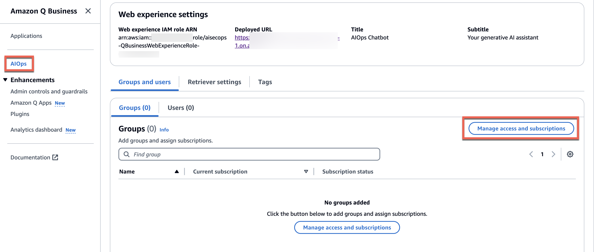
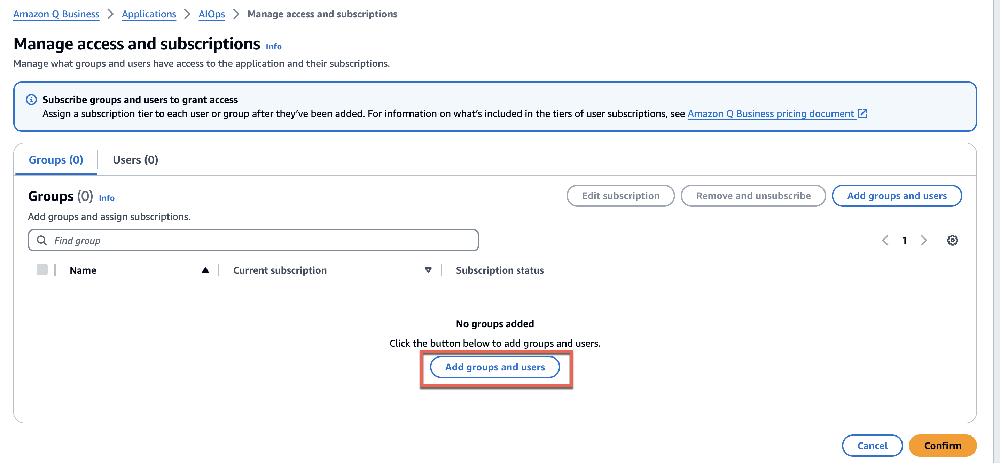
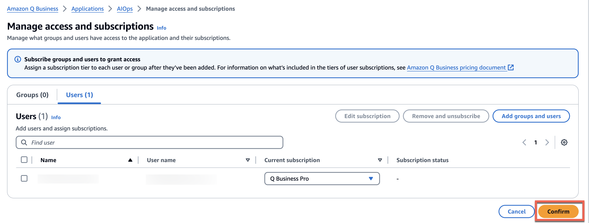
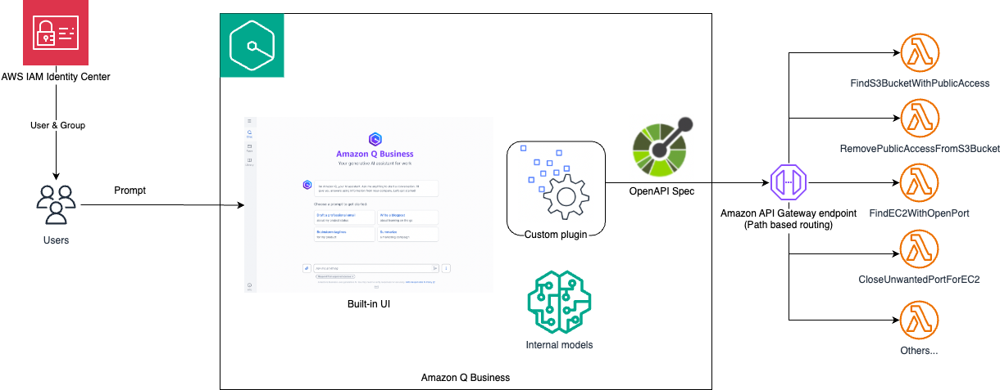

# Creating AI Ops chatbot using Amazon Q Business custom plugin

In this demo app you will learn how Amazon Q Custom Plugins can be used to build chatbot that can interact with multiple APIs via user natural language prompts. You will build an AI Ops chatbot using Amazon Q Business custom plugins that enables users to interact with their AWS infrastructure through natural language queries and commands. The chatbot will be capable of handling tasks such as querying the data about Amazon EC2 instance open ports, Amazon S3 bucket access settings. 

For example, users can ask the chatbot "Which EC2 instances have port 3389 open?" or request actions such as "Please close public access for S3 buckets."

Important: this application uses various AWS services and there are costs associated with these services after the Free Tier usage - see the [AWS Pricing page](https://aws.amazon.com/pricing/) for details. You are responsible for any AWS costs incurred. No warranty is implied in this example.

## Requirements

* [Create an AWS account](https://portal.aws.amazon.com/gp/aws/developer/registration/index.html) if you do not already have one and log in. The IAM user that you use must have sufficient permissions to make necessary AWS service calls and manage AWS resources.
* [AWS CLI](https://docs.aws.amazon.com/cli/latest/userguide/install-cliv2.html) installed and configured
* [Git Installed](https://git-scm.com/book/en/v2/Getting-Started-Installing-Git)
* [AWS Serverless Application Model](https://docs.aws.amazon.com/serverless-application-model/latest/developerguide/serverless-sam-cli-install.html) (AWS SAM) installed
* You must have [Amazon Q Business subscription](https://docs.aws.amazon.com/amazonq/latest/qbusiness-ug/tiers.html).
* You must enable AWS IAM Identity Center.
* [Optional] You can [pre-create the user in your Identity Center directory](https://docs.aws.amazon.com/singlesignon/latest/userguide/addusers.html) that you will be using to log into Q Business application.

## Deployment Instructions

1. Create a new directory, navigate to that directory in a terminal and clone the GitHub repository:
    ``` 
    git clone https://github.com/aws-samples/ai-ops-with-amazon-q-business.git
    ```

2. Change directory to the pattern directory:
    ```
    cd ai-ops-with-amazon-q-business
    ```

3. From the command line, use AWS SAM to deploy the AWS resources:
    ```
    sam deploy -g
    ```

4. During the prompts:

   - Enter a stack name. 
   - Enter `us-east-1` as the AWS Region.
   - You need to enter the IAM Identity Center's Managing instance id as Amazon Q setup needs this. Open [IAM Identity Center](https://console.aws.amazon.com/singlesignon/home) from console and copy the Managing Instance Id from the page to use in the prompts. 
   - Enter `y` for AWS Lambda functions not having authentication.  
   - Leave rest of the options as default.

5. Note the outputs from the SAM deployment process. These contain the resource names and/or ARNs which are used for testing.

6. Open [Amazon Q Business](https://console.aws.amazon.com/amazonq/business/applications) from console and select the **AIOps** application. 


7. Select **Manage access and subscription**.


8. Select **Add groups and users**.


9. Select either **Add and assign new users** or **Assign existing users and groups** depending on if you have precreated the user as per the prerequisite.

    

10. If you have an existing user that you want to provide access to your **AIOps** application, search for the username and **Assign** it. 

    

11. On the review page, select **current subscription** and **confirm**.  



## How it works

* The user interface for chatbot is built using an Amazon Q Business web experience. 
* The user authentication and authorization are handled by AWS IAM Identity Center. 
* Relevant actions are identified based on natural language queries from the users using Amazon Q Business custom plugin.  Amazon Q Business uses the configured third-party OpenAPI specifications to dynamically determine which API operations to perform in order to fulfill an end user request.
* The APIs are implemented using Amazon API Gateway and AWS Lambda functions. 


Refer to the following architecture diagram:




## Testing
Refer to the following steps to log into the chatbot and test it. Responses from large language models are non-deterministic. Hence, you may not get exact same response every time.

1. Log into `QBusinessWebExperienceURL` from the `sam deploy` output using the user credential configured in the previous steps. 

2. After logging into the **AIOps Chatbot**, select the **AIOpsCustomPlugin** as follows:

    

3. [Enable public access on an Amazon S3 bucket](https://docs.aws.amazon.com/AmazonS3/latest/userguide/configuring-block-public-access-bucket.html). This is done for testing purpose only, check your organization policies before performing this test. For this demo we have used a bucket named `aiops-chatbot-demo`.

4. Return to AIOps Chatbot and enter a question such as:  Do I have any S3 bucket with public access?  Provide the bucket prefix to narrow down the search.

    

5. The AIOps chatbot identifies the bucket(s) with public access:

    

6. Ask a follow up question such as: `Please block the public access`. The Chatbot blocks the public access. Validate it from the S3 console.

    

7. Open a port, say 1234, for an Amazon EC2 instance using [security group inbound rules](https://docs.aws.amazon.com/finspace/latest/userguide/step5-config-inbound-rule.html). 
8. Return to the chatbot and enter a question such as: `Do I have any EC2 instance with port 1234 open?` 

    

9.	After the chatbot identifies the EC2 instance with the open port, confirm that you want to close the port.
10.	Chatbot closes the open port and confirms back.

    

## Cleanup
 
1. To delete the resources deployed to your AWS account via AWS SAM, run the following command:
   ```bash
   sam delete
   ```

## License

This library is licensed under the MIT-0 License. See the LICENSE file.

